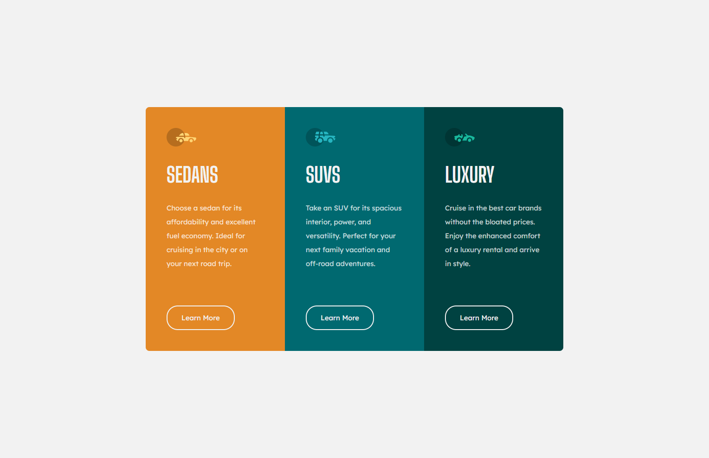

# Frontend Mentor - Results summary component solution

This is a solution to the [3-column preview card component challenge on Frontend Mentor](https://www.frontendmentor.io/challenges/3column-preview-card-component-pH92eAR2-). Frontend Mentor challenges help you improve your coding skills by building realistic projects.

## Table of contents

- [Frontend Mentor - Results summary component solution](#frontend-mentor---results-summary-component-solution)
  - [Table of contents](#table-of-contents)
  - [Overview](#overview)
    - [Screenshot](#screenshot)
    - [Links](#links)
  - [My process](#my-process)
    - [Built with](#built-with)
    - [Continued development](#continued-development)
    - [Useful resources](#useful-resources)
  - [Author](#author)

## Overview

### Screenshot

### Links

- Solution URL: [GitHub](https://github.com/maciej-szeremeta/3-column-preview-card-component)
- Live Site URL: [GitHub Page](https://maciej-szeremeta.github.io/3-column-preview-card-component)

## My process

### Built with

- HTML
- CSS variables
- SCSS
- BEM
- Flexbox

### Continued development

In the next task I will explore the secrets of the preprocessor.

### Useful resources

- [SCSS](https://sass-lang.com/) - This page helped me understand how SCSS works.

## Author

- Frontend Mentor - [@maciej-szeremeta](https://www.frontendmentor.io/profile/maciej-szeremeta)
